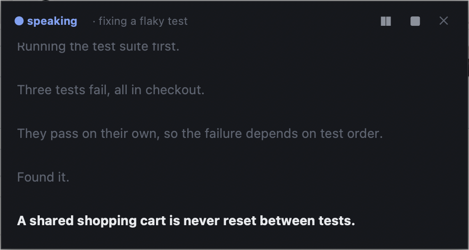

# kokoro-voice

[](https://github.com/PiotrKarpinski/kokoro-voice/actions/workflows/ci.yml)

Claude Code talks to you. Entirely on your machine — no account, no network, no
audio leaving the laptop.

Ask for a summary out loud and hear it in about a sixth of a second. Switch on
narration and hear short progress beats while work happens. Read along in a
floating transcript that follows you across desktops, and interrupt it mid-sentence
with "wait, what was that?" — it pauses, tells you what you just heard, answers in
text, and picks up exactly where it froze.

Built on [Kokoro-82M](https://huggingface.co/hexgrad/Kokoro-82M) (Apache-2.0).

<p align="center">
  
</p>

## Install

```sh
git clone https://github.com/PiotrKarpinski/kokoro-voice ~/kokoro-voice
~/kokoro-voice/install.sh
```

Then, in Claude Code:

```
/plugin marketplace add PiotrKarpinski/kokoro-voice
/plugin install kokoro-voice
```

The installer builds the speech engine; the plugin wires up the skills, the
commands and the hook. Both steps are needed - the plugin alone has no voice,
and the installer alone has no skills.

Context cost, measured with `claude --plugin-dir . plugin details kokoro-voice`:
about 276 tokens always-on, about 1.6k when the voice skill fires. The hook adds
a short mode note to each message — roughly 35 tokens in `on-request`, 170 in
`narrate`, nothing when `off`.

The installer builds an isolated Python environment in `~/.kokoro`, installs
`espeak-ng` through Homebrew, and links `kokoro` and `hush` into `~/.local/bin` (set `KOKORO_HOME` / `KOKORO_BIN` to put them elsewhere).
The first thing you speak downloads the model, about 330 MB, once.

**macOS only.** Playback uses `afplay` and the floating window uses Cocoa. The
speech engine itself is portable; the plumbing around it is not.

## Using it

One skill, `voice`, and one setting with three modes:

| mode | behaviour |
|---|---|
| `on-request` | speaks when you ask — "read me the summary", "say it out loud". The default. |
| `narrate` | short spoken beats while it works, then one spoken summary |
| `off` | never speaks |

Switch with `/voice narrate`, `/voice on`, `/voice off` — or just say "narrate
this" or "voice off". `/voice` on its own speaks a summary of the session.

| | |
|---|---|
| `kokoro --set mode=narrate` | same switch, from a terminal |
| `kokoro --hud on` | floating transcript, always on top |
| `kokoro --config` | every setting, and which you have changed |
| `hush` | stop it, instantly, from any terminal |
| `kokoro --version` | plugin version, commit, and where code and data live |

While it's talking you can just type "wait, what was that?" — it pauses, answers
in text, and resumes from the same sentence. Everything spoken is archived to
`~/.kokoro/spoken/`.

## How it works

A **warm daemon** holds the model in memory, so speech starts in ~150 ms instead
of the ~3.5 s a cold PyTorch import costs. It generates one sentence at a time and
streams them to the player, so you hear sentence one while sentence four does not
exist yet. It exits after 15 idle minutes, restarts itself if its code changes,
and is bounded by a memory ceiling.

A **UserPromptSubmit hook** carries two pieces of state into each turn, and prints
nothing at all when neither applies: whether narration is on, and — while audio is
playing — which sentence you are hearing. That second one is what makes "huh?"
work: Claude can see what you just heard and judge whether your message is about
it, instead of matching against a list of magic phrases.

The **skill** holds the craft: write for the ear, never speak file paths, spell
units out. Those rules are measured, not guessed — `~300 MB` is silently dropped
by the phonemizer, `&&` becomes "and-and", and `player.gd` becomes "player dot
gee dee".

## The transcript window

Off by default — `kokoro --hud on`. When on, it shows for every spoken line,
whether queued with `--bg` or spoken directly, and hides when speech ends. It
starts itself the next time anything is spoken, restarts when its code changes,
and snaps back on screen if it was last left on a display that is no longer
connected. It cannot appear if it is turned off, if Python's Tk is missing, or
off macOS (where it runs without the float-above-everything behaviour).

## Known limits

- macOS only, as above.
- The daemon grows about 100 MB per request. It is capped and restarts itself
  rather than growing without bound, but it is capped, not cured.
- The floating window will not appear above a true fullscreen app on another
  Space unless it is already running.
- English voices are the well-tested ones. Kokoro ships others; they are untried
  here.

## Evals

`python3 evals/run.py` runs real headless Claude Code sessions against a small
fixture project, with the voice in dry-run so nothing plays, and checks what
would have been said: did it speak when asked and stay silent otherwise, did it
avoid filenames, keep summaries to length, respect `off`, pause on "huh?".
Use `--runs 3` — consistency across runs is the thing being measured.

Two faster suites need no Claude session and run on every push in CI:
`python3 evals/test_normalize.py` (the text rules) and `sh evals/test_offline.sh`
(the client in dry-run, modes, both hooks).

## Contributing

macOS only today, and that is plumbing rather than anything deep — the engine is
portable. [PORTING.md](PORTING.md) is an audit of every platform-specific call,
what a Linux port actually needs (about forty lines), and why Windows is harder.
Ports and PRs welcome.

MIT licensed. Kokoro-82M is Apache-2.0.
